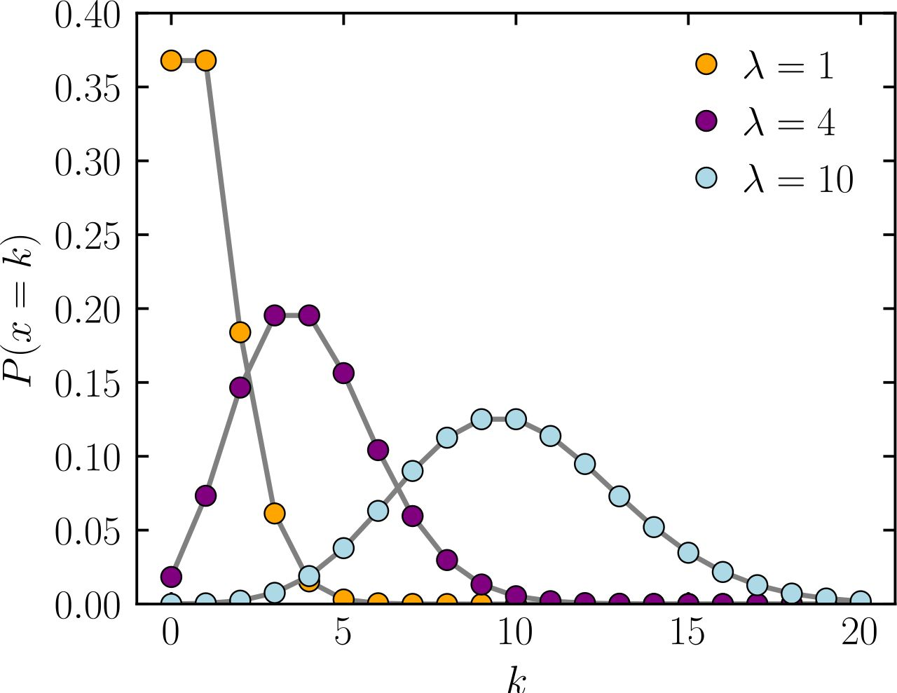
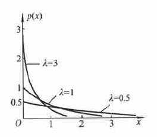
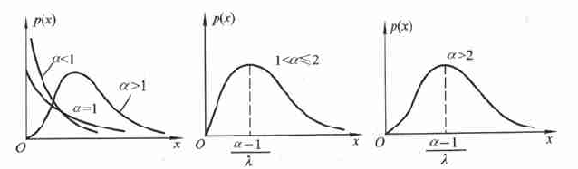
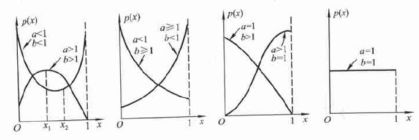

# Distribution

### Poisson

$$
X \sim P(\lambda):~  P(X=k)=\frac{\lambda ^k}{k!}e{-\lambda}
$$

**Mean:** $\lambda$ , **Var:** $\lambda$ ，求出均值就把分布定下来了

泊松分布一般中心偏向于较小值，不对称

### Exponential

$$
X \sim Exp(\lambda):~p(x)=\lambda e^{-\lambda x}u(x)\\
P(X\leq x) = (1-e^{\lambda x}) u(x)
$$

**Mean:** $\frac{1}{\lambda}$ , **Var:** $\frac{1}{\lambda^2}$ 

**无记忆性：** $P(X>s+t|X>s) =P(X>t)$

> 指数分布常被用作各种"**寿命**"分布，譬如**电子元器件的寿命**、**动物的寿命**、**电话的通话时间**、**随机服务系统中的服务时间**等都可假定服从指数分布。指数分布在**可靠性**与**排队论**中有着广泛的应用。

### Gamma

$$
X\sim Ga(\alpha, \lambda):~p(x)=\frac{\lambda^\alpha}{\Gamma(\alpha)}x^{\alpha-1}e^{-\lambda x}~(x\geq 0)
$$

**Mean:** $\frac{\alpha}{\lambda}$ , **Var:** $\frac{\alpha}{\lambda^2}$ 

> 伽马分布是一种连续概率分布，广泛应用于多种场景，特别是那些涉及到等待时间或事件发生所需时间的领域。伽马分布通常用来描述两个或更多个指数分布事件的总和。这里是一些伽马分布的常用场景：
>
> 1. **服务与排队理论**：
>    - 伽马分布可以用来模拟在服务系统中完成多项任务所需的时间，比如顾客在银行或商店的服务时间。
>
> 2. **可靠性工程和寿命测试**：
>    - 在可靠性工程中，伽马分布用于分析设备或系统的寿命，尤其是在需要考虑到多个独立的指数分布寿命因素时。
>
> 3. **医学和生物统计学**：
>    - 伽马分布被用于分析生存时间数据，比如病人的生存期或疾病的恢复时间。
>
> 4. **金融和经济学**：
>    - 在金融领域，伽马分布可以用于建模资产价格的变化或风险分析，尤其是在预测极端市场运动或损失的情况下。
>
> 5. **气象学**：
>    - 在气象学中，伽马分布常用于描述降雨数据，如降雨量的分布或降雨事件的持续时间。
>
> 6. **信号处理和通信**：
>    - 在信号处理领域，伽马分布有时用于分析和处理具有特定统计特性的信号。
>
> 7. **物理和工程学**：
>    - 在物理学中，伽马分布用于描述诸如放射性衰变事件之类的现象。
>
> 总的来说，伽马分布在需要考虑多个相互独立且服从指数分布的事件的总和时非常有用，尤其在涉及等待时间、寿命分析、风险评估和其他类似应用中。

**Gamma 分布的下位：** 三种抽样分布

### Beta 分布

$$
X\sim Be(a,b):~p(x)=B(a,b)x^{a-1}(1-x)^{b-1},~0<x<1
$$

**Mean:** $\frac{a}{a+b}$ , **Var:** $\frac{ab}{(a+b)^2(a+b+1)}$  

> 贝塔分布是一种在[0, 1]区间内的连续概率分布，常用于描述概率的概率，即概率的不确定性。它在多个领域有着广泛的应用：
>
> 1. **贝叶斯统计**：
>    - 在贝叶斯统计中，贝塔分布常作为二项分布参数的先验分布。例如，在抛硬币实验中，贝塔分布可以用来描述硬币正面朝上的概率的不确定性。
>
> 2. **机器学习和人工智能**：
>    - 在机器学习领域，特别是在强化学习中，贝塔分布可用于建模代理对环境状态的不确定性。
>
> 3. **项目管理**：
>    - 在项目管理中，贝塔分布用于风险评估，尤其是在估计项目完成时间或成本时，可以用来模拟不确定性。
>
> 4. **医学统计**：
>    - 在医学研究中，贝塔分布用于分析药物效果的变异性，特别是在临床试验中评估治疗效果的概率。
>
> 5. **心理学和社会科学研究**：
>    - 在心理学和社会科学中，贝塔分布可以用于分析人们对某些事件或现象发生概率的主观判断。
>
> 贝塔分布的灵活性在于它能够呈现出多种形态，从而适用于描述各种不同类型的概率和比率数据。